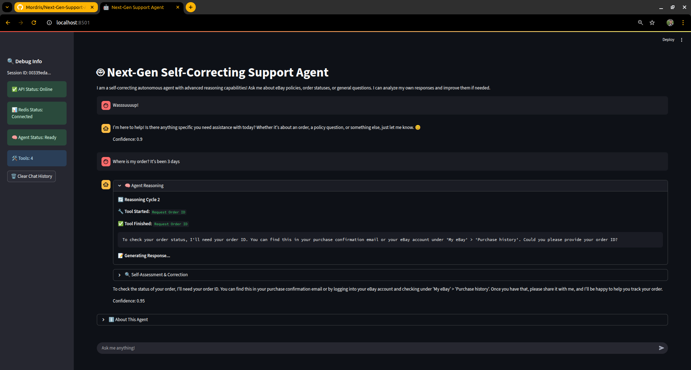
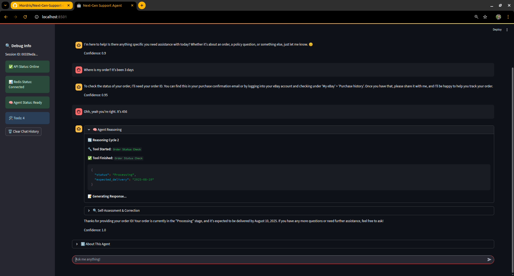
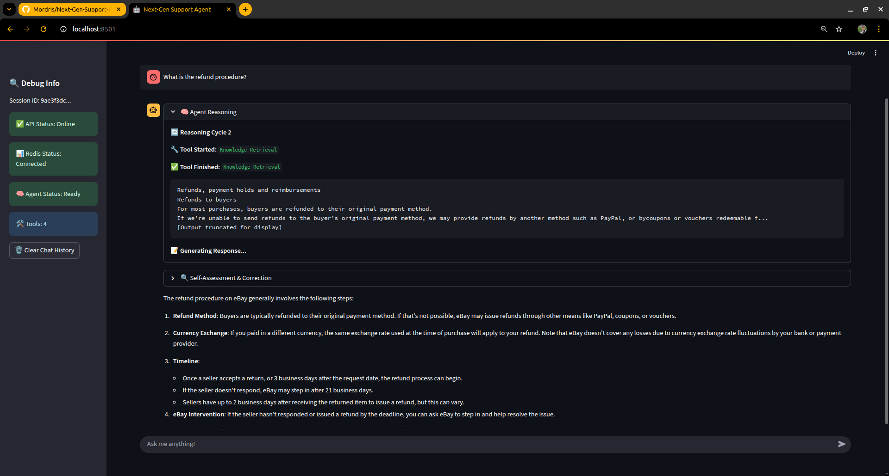
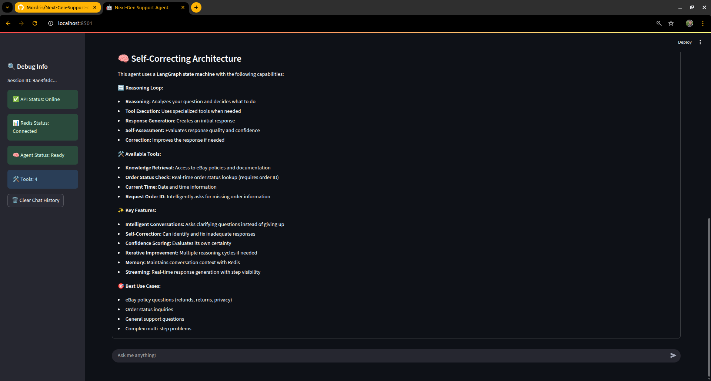

# Next-Gen Support Agent Blueprint

> **⚠️ Work in Progress**
> This project is currently under active development. The code, features, and architecture are subject to frequent changes as the blueprint evolves. Contributions and feedback are welcome!

---

This repository contains the source code for a production-grade, self-correcting AI customer support agent. The agent is designed to act as an intelligent eBay support chatbot, capable of using tools, performing Retrieval-Augmented Generation (RAG) on policy documents, and iteratively improving its own responses through a reasoning loop.

---

### 🚀 In Action

Here’s a look at the agent's key features in action:

<table>
  <tr>
    <td align="center"><b>Intelligent Clarification</b><br>The agent recognizes that an order ID is missing and proactively asks the user for it instead of failing.</td>
    <td align="center"><b>Successful Tool Use</b><br>Once the user provides the ID, the agent uses the <code>get_order_status</code> tool and provides the correct information.</td>
  </tr>
  <tr>
    <td></td>
    <td></td>
  </tr>
  <tr>
    <td align="center"><b>Knowledge Base RAG</b><br>For policy questions, the agent uses its RAG tool to retrieve relevant context from PDF documents.</td>
    <td align="center"><b>Transparent Reasoning</b><br>The UI provides a transparent view into the agent's thought process, including which tools were used.</td>
  </tr>
  <tr>
    <td></td>
    <td></td>
  </tr>
</table>

---

### ✨ Key Features

- **Self-Correcting Reasoning Loop**: Built with `LangGraph`, the agent operates on a state machine that allows it to reason, act, assess its own responses, and perform corrections if the quality or confidence is low.
- **Tool-Augmented AI**: The agent can use a variety of tools to answer questions dynamically:
  - **Knowledge Base RAG**: Retrieves information from eBay's policy documents (User Agreement, Money Back Guarantee, etc.) to answer complex questions.
  - **Order Status Lookup**: Fetches the status of an order given an ID (using a mock database).
  - **Intelligent Clarification**: If a user asks about an order without providing an ID, the agent proactively asks for the missing information instead of failing.
- **Advanced RAG Pipeline**: Implements a sophisticated Retrieval-Augmented Generation pipeline using `ChromaDB` for vector storage, `HuggingFace` embeddings, and `Flashrank` for fast, high-quality reranking of retrieved documents.
- **Streaming & Observability**: The FastAPI backend streams the agent's thought process step-by-step to the user interface, providing transparency into its reasoning cycle.
- **Containerized & Scalable**: The entire application stack (API, UI, Redis, ChromaDB) is fully containerized using Docker and managed with Docker Compose for easy setup and deployment.
- **Conversation Memory**: Uses Redis to maintain conversation history, allowing for contextual follow-up questions.
- **Interactive UI**: A user-friendly frontend built with Streamlit that displays the agent's responses and provides a debug panel to observe its internal state and reasoning process.

---

### 🏗️ Architecture Overview

The application is composed of four main containerized services managed by `docker-compose`:

1.  **Frontend (`ui`)**: A Streamlit application that serves as the user interface for the chatbot.
2.  **API (`api`)**: A FastAPI application that exposes the agent's capabilities. It handles business logic, orchestrates the LangGraph agent, and streams responses.
3.  **Redis (`redis`)**: Used for persistent, session-based conversation memory.
4.  **Chroma (`chroma`)**: The vector database that stores embeddings of the eBay policy documents for the RAG functionality.

```ascii
+----------------+      +------------------+      +---------------------+
|                |      |                  |      |                     |
|  Streamlit UI  |----->|  FastAPI Backend |----->|  Self-Correcting    |
|   (frontend)   |      |      (api)       |      |    Agent (LangGraph)|
|                |      |                  |      |                     |
+----------------+      +--------+---------+      +----------+----------+
                                 |                          |
                                 |                          |
               +-----------------+------------------+       |
               |                 |                  |       |
      +--------v--------+ +------v------+   +-------v-------+
      |                 | |             |   |               |
      | Conversation    | | Knowledge   |   |   Tools       |
      | Memory (Redis)  | | Base (Chroma)|   | (API calls etc) |
      |                 | |             |   |               |
      +-----------------+ +-------------+   +---------------+
```

---

### 📂 Project Structure

```
.
├── Docs/
│   └── Screenshots/      # Contains screenshots for the README
├── app/                  # Main FastAPI application source code
│   ├── core/             # Core logic of the agent
│   │   ├── agent.py      # LangGraph agent definition, nodes, and state
│   │   ├── config.py     # Application configuration
│   │   ├── retriever.py  # RAG retriever setup
│   │   ├── security.py   # API key security
│   │   └── tools.py      # Agent tools definitions
│   └── main.py           # FastAPI app entrypoint, routes, and streaming logic
├── data/                 # Source PDF documents for the knowledge base
├── scripts/              # Helper scripts
│   └── ingest.py         # Script to process and ingest data into ChromaDB
├── ui/                   # Streamlit UI application source code
│   ├── main.py           # The Streamlit UI code
│   ├── Dockerfile        # Dockerfile for the UI service
│   └── requirements.txt  # Python dependencies for the UI
├── .env                  # Environment variables (needs to be created)
├── docker-compose.yml    # Defines all services for the application stack
├── Dockerfile            # Dockerfile for the main API service
└── pyproject.toml        # Python project dependencies for the API
```

---

### 🚀 Getting Started

#### Prerequisites

- Docker
- Docker Compose

#### 1. Configure Environment

Create a `.env` file in the root of the project by copying the example below. This file will hold your API keys and other secrets.

```env
# .env file
# It is recommended to use a strong, randomly generated key
API_KEY="your_secret_api_key_here"

# Your OpenAI API Key (or other LLM provider)
OPENAI_API_KEY="sk-..."
```

#### 2. Ingest Knowledge Base Documents

The agent's knowledge base is powered by the PDF files in the `/data` directory. You must run the ingestion script to process these files and store them in the Chroma vector database.

First, build the services:

```bash
docker-compose build
```

Then, run the ingestion script:

```bash
docker-compose run --rm api poetry run python scripts/ingest.py
```

You should see output indicating that the documents are being loaded, split, and ingested.

#### 3. Run the Application

Start all services using Docker Compose:

```bash
docker-compose up
```

The services will now be available at:

- **💬 Chat UI**: `http://localhost:8501`
- **⚙️ API Docs**: `http://localhost:8000/docs`

---

### ⚙️ How It Works: The Agent's Mind

The core of this project is the `SelfCorrectingAgent`, which follows a cyclical, state-driven process managed by LangGraph:

1.  **Reasoning**: The agent first analyzes the user's message and the conversation history to decide on a plan. It determines if it needs to use a tool or if it can answer directly.
2.  **Tool Execution**: If a tool is needed (e.g., `retrieve_context` for a policy question or `get_order_status` for an order query), it executes it and gets the result.
3.  **Response Generation**: Based on the tool's output or its initial reasoning, the agent generates a response for the user.
4.  **Self-Assessment**: This is the critical step. The agent analyzes its own generated response, assigning a confidence score and checking for potential issues (e.g., did it give up too easily? Did it fail to use a relevant tool?).
5.  **Correction (If Needed)**: If the assessment reveals a flaw (e.g., low confidence), the agent enters a correction loop. It re-evaluates the problem with new instructions (e.g., "You gave up too easily, try asking for the order ID"), and the cycle begins again from the reasoning or tool execution step.
6.  **Final Answer**: Once the agent is confident in its response, it delivers the final answer to the user.

This entire process is streamed to the UI, allowing you to watch the agent "think" in real-time.
